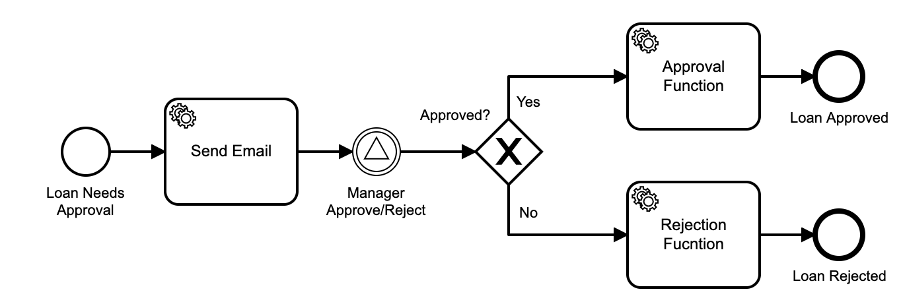

## References

State machines/Workflows have a long history in software design. This section goal is to list other tools and languages that had been used to define orchestration between different actors (software and human). The main intention here is to make sure that we cover as many use cases as possible leveraging exissting approaches to avoid pitfalls from the past. 

### BPMN 2.0 by OMG

[Business Process Modeling and Notation (BPMN)](https://www.omg.org/spec/BPMN/2.0/About-BPMN/) was designed by Object Management Group (OMG) in collaboration with companies such as: IBM, Red Hat, Oracle, SAP, TIBCO, Software AG, among others. The latest version of the specification provides a rich set of constructs to define workflows in a technology agnostic way. One of the main advatages of the BPMN spec is that it defines visually how a workflow should look like and most importantely, it also defines the execution semantics of such workflows. 

Workflows modeled using the BPMN specification can express a large number of use cases, covering the use cases listed in the [Serverless Workflow Specification - Use Cases](spec-usecases.md). 

BPMN provides the following constructs to define workflows capabiltiies:
- Events: Emitting and catching events that are relevant to a workflow instance
  - Catch Event
  - Throw Event
  - Timer
- Messages: Enable communication between different workflow instances
  - Throw
  - Catch  
- Gateways: Enable fork/join behaviours based on certain condition
  - Exclusive
  - Parallel
  - Complex  
- Tasks: Orchestrate interactions between systems and people
  - User Task 
  - Service Task
  - Business Rule Task 
- Aggregation: Provide a mechanism to deal with complexity when workflows become to large to understand
  - Embedded Sub Process
  - Call Activity

There are currently several implementations of the BPMN specification, including tooling and runtime environments to execute these workflows. 

The BPMN Specificaiton defines XML Schemas for defining and validating workflow definitions.  

Here are a the BPMN diagrams covering two examples listed in the [Serverless Workflow Specification - Use Cases](spec-usecases.md) section: 

** Loan Approval Workflow **

You can find the BPMN XML which can be executed in a number of Open Source and Propietary engines [here](media/references/loan-approval-workflow.bpmn)

** Travel Booking Workflow **

You can find the BPMN XML which can be executed in a number of Open Source and Propietary engines [here](media/references/travel-booking-workflow.bpmn)
